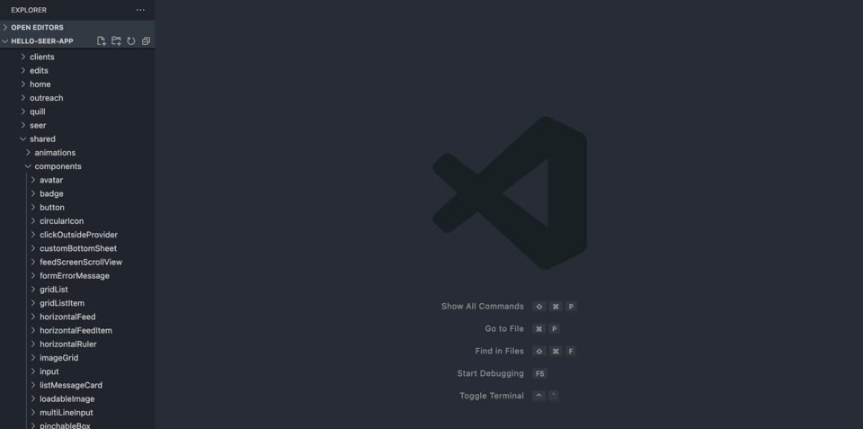

# Bothrs Sidekick README

This extension provides adds some helper functionality to Visual Studio Code.

## Features

### Component generator

A tool to easily create the boilerplate for a component.

The tool will change the structure it generates the files in based on your `Product Team` and `Framework`.

> Tip: Many popular extensions utilize animations. This is an excellent way to show off your extension! We recommend short, focused animations that are easy to follow.

<!-- ## Requirements

If you have any requirements or dependencies, add a section describing those and how to install and configure them. -->

## Extension Settings

This extensions provides the following settings:

- `bothrs.framework`: Specify the framework, the default auto detects the framework your project uses. Supported options are `automatic`, `react` and `react-native`.
- `bothrs.shouldOpenCreatedComponentFile`: Specify if Bothrs Sidekick should open the created component file.

> Tip: Configure the project specific options in a project settings file. This way everyone who is working on the project will use the same setup.

<!-- ## Known Issues

Calling out known issues can help limit users opening duplicate issues against your extension. -->

---

## Release Notes

Releases

### 1.0.0

Inital release of Bothrs Sidekick.

### 2.0.0

Merged different team standards into one.

### 3.2.0

Added tailwind support

### 3.2.2

Fixed react-native syntax being used in default react templates

<!-- ### 1.0.1

Fixed issue #. -->

<!-- ### 1.1.0

Added features X, Y, and Z. -->

---

<!--
## Following extension guidelines

Ensure that you've read through the extensions guidelines and follow the best practices for creating your extension.

- [Extension Guidelines](https://code.visualstudio.com/api/references/extension-guidelines)

## Working with Markdown

**Note:** You can author your README using Visual Studio Code. Here are some useful editor keyboard shortcuts:

- Split the editor (`Cmd+\` on macOS or `Ctrl+\` on Windows and Linux)
- Toggle preview (`Shift+CMD+V` on macOS or `Shift+Ctrl+V` on Windows and Linux)
- Press `Ctrl+Space` (Windows, Linux) or `Cmd+Space` (macOS) to see a list of Markdown snippets

### For more information

- [Visual Studio Code's Markdown Support](http://code.visualstudio.com/docs/languages/markdown)
- [Markdown Syntax Reference](https://help.github.com/articles/markdown-basics/) -->
